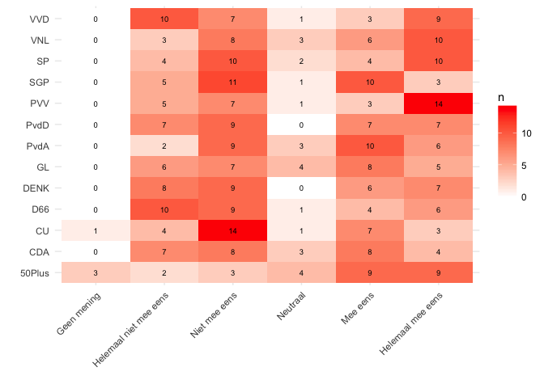
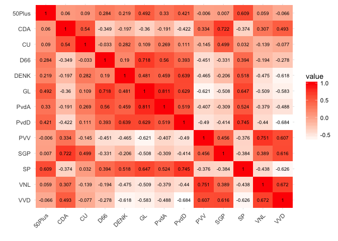
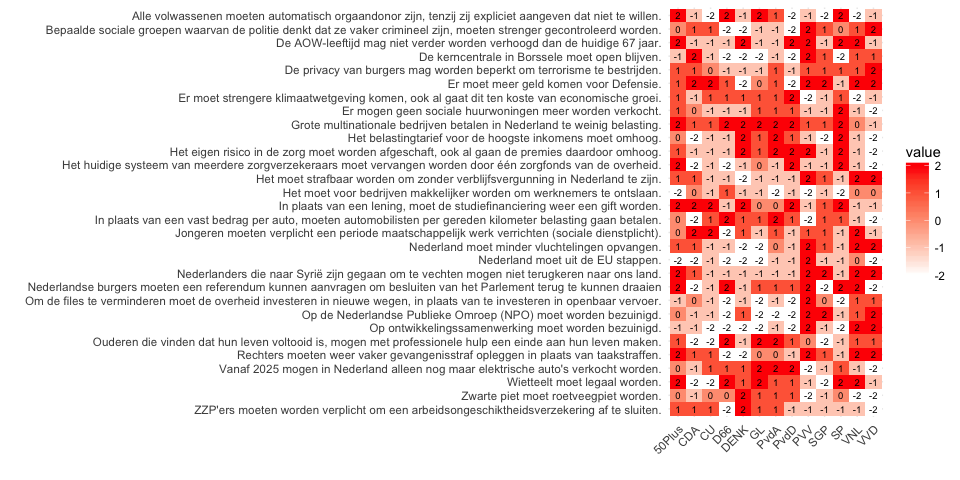
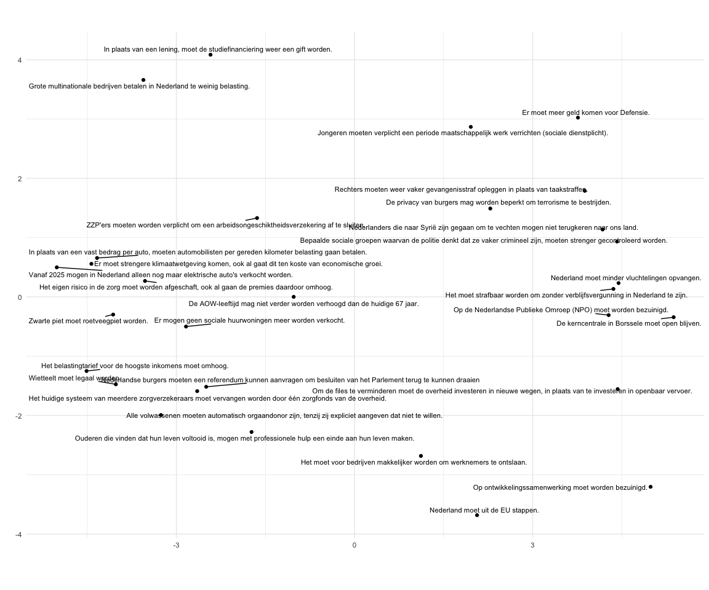

Kieskompas stellingen
================

## Laad de data

``` r
stellingen_json <- readLines('data/kieskompas_stellingen.json')
```

    ## Warning in readLines("data/kieskompas_stellingen.json"): incomplete final
    ## line found on 'data/kieskompas_stellingen.json'

``` r
answers_json    <- readLines('data/kieskompas_answers.json')
```

    ## Warning in readLines("data/kieskompas_answers.json"): incomplete final line
    ## found on 'data/kieskompas_answers.json'

``` r
stellingen_df <- jsonlite::fromJSON(stellingen_json, flatten = TRUE)
answers_df    <- jsonlite::fromJSON(answers_json, flatten = TRUE) 
```

## Pre-process data

``` r
answers_df <- answers_df %>% 
  group_by(id, name, short_name, logo, chart_color) %>% 
  do(.$answers[[1]]) %>% 
  ungroup %>% 
  select(-answer.is_skip)

kieskompas_df <- answers_df %>%
  left_join(stellingen_df %>% 
              select(id, statement_name = name, statement_text = statement, 
                     axis, inverse, theme.name, theme.identifier),
            by = c('statement' = 'id'))
```

## Analyse

Verdeling van antwoorden over de partijen:

``` r
kieskompas_df %>% 
  count(name, answer.text_content) %>% 
  spread(answer.text_content, n, fill = 0) %>% 
  gather(answer.text_content, n, -name) %>% 
  mutate(answer.text_content = factor(answer.text_content, 
                                      levels = c('Geen mening', 'Helemaal niet mee eens', 
                                                 'Niet mee eens', 'Neutraal', 'Mee eens',
                                                 'Helemaal mee eens'))) %>% 
  ggplot(aes(x=answer.text_content, y=name, fill=n, label = n)) +
    geom_tile() +
    geom_text(size = 2.5) +
    scale_fill_continuous(low = 'white', high = 'red') +
    theme_minimal() +
    theme(axis.text.x = element_text(angle = 45, vjust = 1, hjust = 1)) +
    xlab('') + ylab('')
```

<!-- -->

Maak tabellen voor analyse van de stellingen

``` r
# table
kieskompas_table <- kieskompas_df %>%
  select(name, theme.name, statement_text, answer.value) %>% 
  mutate(answer.value = if_else(answer.value == 99, as.integer(0), answer.value)) %>% 
  spread(name, answer.value)

kk_mat <- kieskompas_table %>% 
  remove_rownames() %>% 
  as.data.frame() %>% 
  column_to_rownames('statement_text') %>% 
  select(-theme.name)
```

Correlatie heatmap:

``` r
cor(kk_mat) %>%
  as.data.frame() %>% 
  rownames_to_column('party_1') %>% 
  gather(party_2, value, -party_1) %>% 
  ggplot(aes(x=party_1, y=forcats::fct_rev(party_2), fill=value, label = round(value,3))) +
    geom_tile() +
    geom_text(size = 2.5) +
    scale_fill_continuous(low = 'white', high = 'red') +
    theme_minimal() +
    theme(axis.text.x = element_text(angle = 45, vjust = 1, hjust = 1)) +
    xlab('') + ylab('')
```

<!-- -->

Algemene heatmap:

``` r
kk_mat %>%
  as.data.frame() %>% 
  rownames_to_column('stelling') %>% 
  gather(party, value, -stelling) %>% 
  ggplot(aes(x=party, y=forcats::fct_rev(stelling), fill=value, label = round(value,3))) +
    geom_tile() +
    geom_text(size = 2.5) +
    scale_fill_continuous(low = 'white', high = 'red') +
    theme_minimal() +
    theme(axis.text.x = element_text(angle = 45, vjust = 1, hjust = 1)) +
    xlab('') + ylab('')
```

<!-- -->

Multi-dimensional scaling

``` r
# MDS
library(ggrepel)
cmdscale(dist(kk_mat),2) %>%
  as.data.frame %>%
  rownames_to_column('partij') %>%
  ggplot(aes(x=V1, y=V2)) + 
    geom_point() + 
    geom_text_repel(aes(label = partij), size = 3) + 
    coord_fixed() +
    theme_minimal() +
    xlab('') + ylab('')
```

<!-- -->
