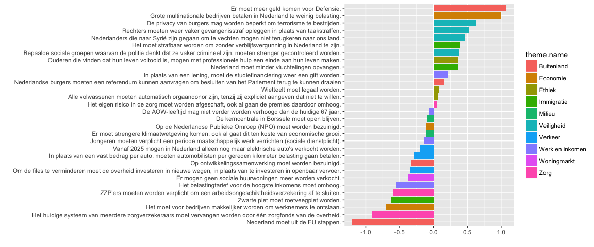

Uitslag Stellingen
================

``` r
library(dplyr)
```

    ## 
    ## Attaching package: 'dplyr'

    ## The following objects are masked from 'package:stats':
    ## 
    ##     filter, lag

    ## The following objects are masked from 'package:base':
    ## 
    ##     intersect, setdiff, setequal, union

``` r
library(tibble)
library(ggplot2)
library(tidyr)
library(forcats)
```

## Laad de data

``` r
stellingen_json <- readLines('data/kieskompas_stellingen.json')
```

    ## Warning in readLines("data/kieskompas_stellingen.json"): incomplete final
    ## line found on 'data/kieskompas_stellingen.json'

``` r
answers_json    <- readLines('data/kieskompas_answers.json')
```

    ## Warning in readLines("data/kieskompas_answers.json"): incomplete final line
    ## found on 'data/kieskompas_answers.json'

``` r
stellingen_df <- jsonlite::fromJSON(stellingen_json, flatten = TRUE)
answers_df    <- jsonlite::fromJSON(answers_json, flatten = TRUE) 
```

## Pre-process data

``` r
answers_df <- answers_df %>% 
  group_by(id, name, short_name, logo, chart_color) %>% 
  do(.$answers[[1]]) %>% 
  ungroup %>% 
  select(-answer.is_skip)

kieskompas_df <- answers_df %>%
  left_join(stellingen_df %>% 
              select(id, statement_name = name, statement_text = statement, 
                     axis, inverse, theme.name, theme.identifier),
            by = c('statement' = 'id'))
```

Uitslagen van de verkiezingen:

``` r
uitslag_zetels <- tibble(partij = c('VVD','PVV','CDA','D66','GL','SP',
                                    'PvdA','CU','PvdD','50Plus','SGP','DENK','FvD'),
                         uitslag = c(33, 20, 19, 19, 14, 14, 9, 5, 5, 4, 3, 3, 2)) %>% 
  arrange(partij) %>% 
  mutate(uitslag_prop = uitslag/sum(uitslag))
```

``` r
kieskompas_table <- kieskompas_df %>%
  select(name, theme.name, statement_text, answer.value) %>% 
  mutate(answer.value = if_else(answer.value == 99, as.integer(0), answer.value)) %>% 
  spread(name, answer.value)

kk_mat <- kieskompas_table %>% 
  remove_rownames() %>% 
  as.data.frame() %>% 
  column_to_rownames('statement_text') %>% 
  select(-theme.name)
```

``` r
kieskompas_parties <- colnames(kk_mat)
selected_parties <- intersect(kieskompas_parties, uitslag_zetels$partij)

kk_mat <- kk_mat[,(kieskompas_parties %in% selected_parties)]
uitslag_zetels <- uitslag_zetels %>% filter(partij %in% selected_parties)

uitslag_stellingen <- as.matrix(kk_mat) %*% uitslag_zetels$uitslag_prop %>%
  as_tibble() %>% cbind(kieskompas_table %>% select(theme.name, statement_text)) %>%
  select(theme.name, statement_text, value = V1) %>% 
  arrange(desc(value))
```

``` r
ggplot(uitslag_stellingen) + 
  geom_bar(aes(x=fct_reorder(statement_text, value), y=value, fill = theme.name), stat = 'identity') + 
  coord_flip() +
  xlab('') + ylab('')
```

<!-- -->
